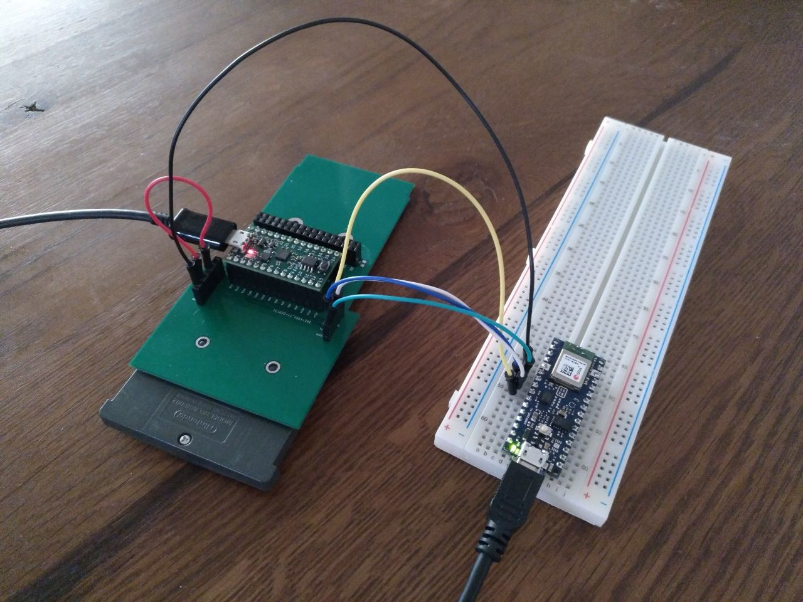
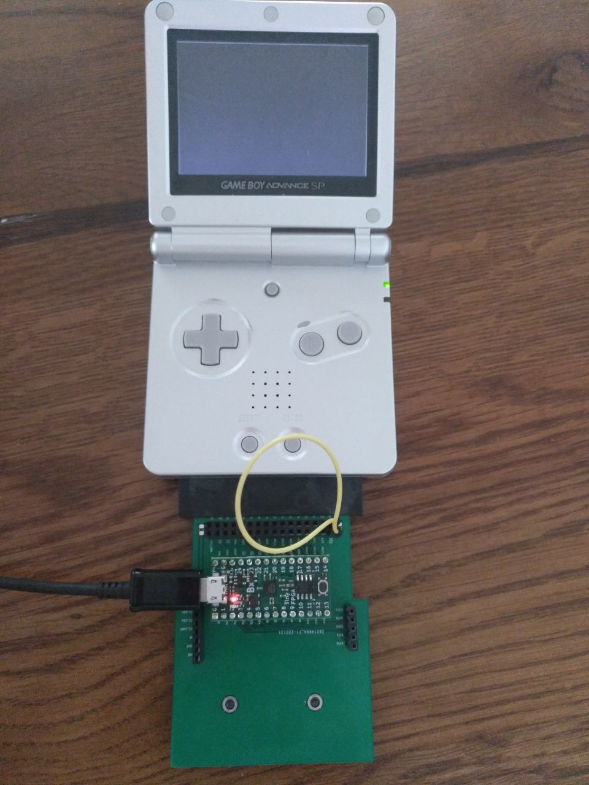

# GameBoy Advance cartridge

This project is about making homebrew cartridges for the GameBoy Advance, using an FPGA (here a [TinyFPGA](https://tinyfpga.com/) BX).
Given the update frequency (and the fact that both falling-edges and rising-edges are meaningful), this is more convenient than bit-banging using some micro-controller.
A few experiments are available, some making use of an additional micro-controller (here an [Arduino Nano 33 BLE](https://store.arduino.cc/products/arduino-nano-33-ble)) for communication.


## Cartridge protocol

The cartridge has the following pins:

 * 1: `VCC`, at 3.3V.
 * 2: `PHI`, the physical clock, which can be configured (disabled, 4.19MHz, 8.38MHz, 16.78MHz). Disabled by default. See [waitstate control](https://www.akkit.org/info/gbatek.htm#gbasystemcontrol).
 * 3: `~WR`, write control.
 * 4: `~RD`, read control.
 * 5: `~CS`, select ROM.
 * 6-21: `AD`, address and data.
 * 22-29: `A`, address or data.
 * 30: `CS2`, select SRAM.
 * 31: `IRQ`, interrupt request. Can be left unconnected or grounded.
 * 32: `GND`, ground.

General comments about memory accesses:

 * Data format is always little endian, i.e. least significant byte is first.
 * Depending on the requested (virtual) address and operation, the GameBoy will either assume ROM or RAM when accessing the cartridge.
 * Since GamePak ROM bus is 16-bits, ARM instructions (32-bits) are slow to fetch. It is better to use THUMB instructions, or copy the code in WRAM.
 * GamePak accesses can be either sequential or non-sequential. The first access to a random location in ROM must be non-sequential.
 * The GameBoy will wait a few cycles when accessing memory. Up to 3 configurations can be used (useful if the cartridge has multiple ROM units with different physical properties). By default, it will assume 4 cycles for random access, and then 2 cycles for sequential access. See [waitstate control](https://www.akkit.org/info/gbatek.htm#gbasystemcontrol).

A read access from the ROM is done as follows:

 * On `~CS` falling-edge, the cartridge latches A0-A23 as address.
 * On `~RD` falling-edge, the cartridge fetches the data at latched address and outputs D0-D15. The output must be ready by next rising-edge of `~RD` (depends on waitstates).
 * On `~RD` rising-edge, the cartridge increments latched address by one (i.e. allow sequential read by just strobing `~RD`).
 * On `~CS` rising-edge, the transaction is done.

Note that ROM data is 16-bits, hence data is aligned on 2-bytes steps.
This means the implicit least-significant bit of the address is always 0 (i.e. A0-A23 is the address divided by 2).

Therefore, a simple read-only GamePak ROM does not use `PHI`, `~WR`, `~CS2` and `IRQ`.

It should also be possible to write to ROM, using a similar scheme, but with `~WR` instead of `~RD`.
To be tested.

Also note that the `AD` bus is used in both direction.
The cartridge should actively write only when both `~CS` and `~RD` are low.

Relevant links:

 * https://www.gbadev.org/
 * https://www.akkit.org/info/gbatek.htm#auxgbagamepakbus
 * https://www.darkfader.net/gba/
 * http://files.darkfader.net/gba/files/cartridge.txt
 * https://douevenknow.us/post/68126856498/arduino-based-gba-rom-dumper-part-1
 * https://reinerziegler.de.mirrors.gg8.se/GBA/gba.htm
 * https://dhole.github.io/post/gameboy_cartridge_emu_1/
 * https://retrocomputing.stackexchange.com/questions/11732/how-does-the-gameboys-memory-bank-switching-work
 * http://www.dl9sec.de/prj_gbacart.html
 * https://github.com/uXeBoy/GBA
 * http://bitwise.bperki.com/2018/08/08/custom-game-boy-cartridge-project-update-1/
 * https://www.insidegadgets.com/2018/04/18/building-a-2mb-mbc5-gameboy-cart-part-1-cpld-as-the-mbc-and-adding-flash-as-our-rom/
 * https://github.com/dwaq/Homebrew-Gameboy-Cartridge
 * http://www.hardwarebook.info/Game_Pak
 * https://www.insidegadgets.com/2011/03/19/gbcartread-arduino-based-gameboy-cart-reader-%E2%80%93-part-1-read-the-rom/
 * https://github.com/Shyri/gba-bt-hid
 * https://github.com/uXeBoy/GBArduboy


## Compiling a GameBoy Advance game

The GameBoy Advance features an ARM-based processor.
We will use [devkitPro](https://devkitpro.org/wiki/Main_Page) to compile binaries.

The most straightforward approach is to use the [Docker image](https://github.com/devkitPro/docker).
We share the local folder with the container, to avoid unnecessary copies.

```
# Run in interactive mode
docker run -ti -v ${PWD}:/rom devkitpro/devkitarm
# On Windows: docker run -ti -v %cd%:/rom devkitpro/devkitarm

# Add compiler binaries to path
export PATH="/opt/devkitpro/devkitARM/bin/:$PATH"

# Go to shared folder and build files
cd /rom/
make
```

Links related to GBA software development:

 * https://www.coranac.com/tonc/text/setup.htm
 * https://devkitpro.org/wiki/Getting_Started
 * https://github.com/devkitPro/docker
 * https://github.com/devkitPro/gba-examples
 * http://kylehalladay.com/blog/tutorial/gba/2017/03/28/GBA-By-Example-1.html
 * https://www.coranac.com/tonc/text/setup.htm#sec-dkp
 * https://www.akkit.org/info/gbatek.htm#gbakeypadinput

Emulators and GameBoy implementations:

 * [mGBA](https://mgba.io/)
 * No$GBA
 * [FPGBA](https://github.com/RobertPeip/FPGBA)


## Development PCB

In order to have a flexible playground, a custom-made PCB has been designed using [KiCad](https://www.kicad.org/) and ordered on [JLCPCB](https://jlcpcb.com/).
[This](https://www.aliexpress.com/item/1005003412771520.html) cheap cartridge header can be soldered to connect an actual cartridge, if needed.
A simple casing has been designed using [FreeCAD](https://www.freecadweb.org/) and 3D-printed (resin) to properly fit the GameBoy Advance.
Depending on whether a GameBoy Advance and/or a cartridge is used, the FPGA can have various roles.

 * The 32 pins of the cartridge are forwarded from the GameBoy to the cartridge.
 * Two sets of connectors are available to intercept (or drive) the pins: a 2x16 header for generic usage, and a 2x14 header designed to hold the TinyFPGA BX.
 * A dedicated header is available to configure power supply.
 * `A` is not exposed to the TinyFPGA BX, as there are not enough pins. Note that some GPIO pins are exposed as pads by the FPGA, but this is not convenient for this project.
 * Instead, some pins are exposed as "extra", and can be used either for external communication (e.g. SPI) or connected to `A` to extend the address space.

See the [schema](pcb.sch.pdf) for more details.


## Getting started with TinyFPGA BX

As described in the [User Guide](https://tinyfpga.com/bx/guide.html), install [APIO](https://github.com/FPGAWARS/apio):

```
conda create -n fpga python=3.7
activate fpga
pip install apio==0.4.0b5 tinyprog
apio install system scons icestorm iverilog
```

Connect the board and run:

```
apio install drivers
apio drivers --serial-enable
```

Reconnect the board, and check that the device is recognized.
Windows might take a few seconds to actually detect and properly setup the serial device.

```
apio system --lsserial
```

Make sure the board is up-to-date:

```
tinyprog --update-bootloader
```

For better integration, use [Atom](https://atom.io/) and install the `apio-ide` package.
Note that you should run Atom inside the Conda environment, so that paths are properly set up:

```
atom --new-instance
```

Using the [default template](https://github.com/tinyfpga/TinyFPGA-BX/tree/master/apio_template), you can quickly start developing the TinyFPGA.

Note that you can upload the code by calling `tinyprog` directly:

```
tinyprog --program hardware.bin
```

The `apio-ide` package provide shortcuts for the most common operations, i.e. build and program.
Use `F8` to show the compilation log after a successful build.

Links:

 * https://tinyfpga.com/
 * http://www.clifford.at/icestorm/
 * https://www.youtube.com/watch?v=ZNunxg7o8l0
 * https://hackaday.io/project/159191-fpga-bootcamp-1
 * https://github.com/YosysHQ/nextpnr


## Experiments

A few simple experiments have been made until now.


### Cartridge reader

An Arduino Nano 33 BLE is connected to a TinyFPGA BX over SPI.



| Name | Arduino Nano 33 BLE | Wire | Board | TinyFPGA BX |
| ---- | ---- | ---- | ---- | ---- |
| GND | GND | black | GND | GND | GND |
| MISO | D2 (2) | green | EXT0 | 1 (A2) |
| MOSI | D3 (3) | blue | EXT1 | 2 (A1) |
| SCK | D4 (4) | white | EXT2 | 3 (B1) |
| SS | D5 (5) | yellow | EXT3 | 4 (C2) |

The cartridge is powered by the TinyFPGA BX, i.e. `VCC_CART` is connected to `VOUT`.

This is a naive implementation of the above-mentioned protocol:

 * The FPGA toggles `~CS` and `~RD`, writes the address and reads the output through `AD`. Note that, as `A` is ignored, only the first 131072 can be read.
 * The Arduino acts as a bridge, communicating with the FPGA using SPI and with the computer using USB.
 * A Python script sends the commands and dumps the content to a binary file.

See [`./reader/`](./reader/) for more details.


### Minimal cartridge

The TinyFPGA BX acts as a read-only ROM cartridge.
A simple "game" is provided, where a white dot is moved using the arrows.



See [`./minimal/`](./minimal/) for more details.
